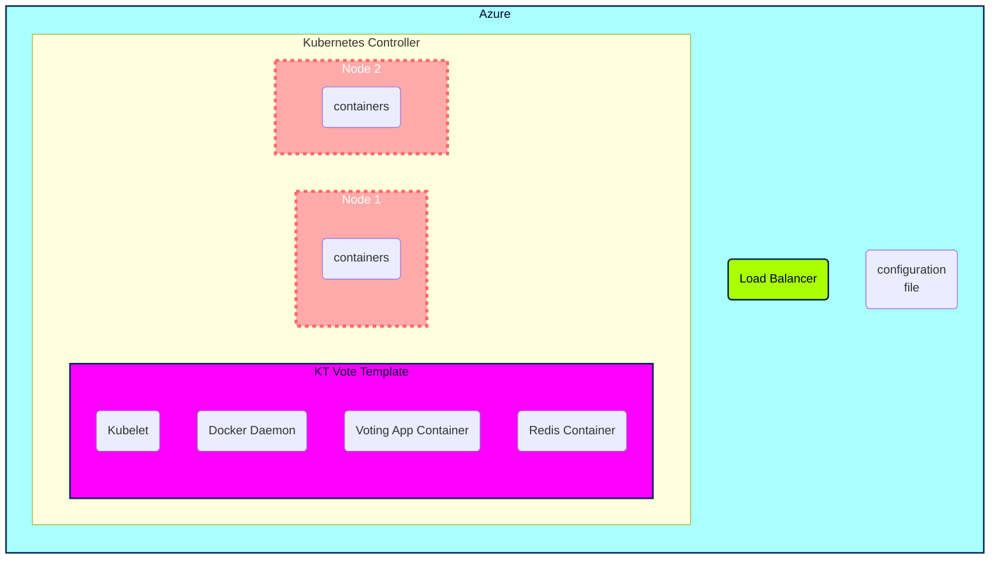

# Plan d'action présentation  

# Plan d'action

00. **Scrum quotidien**
Réflexion personnelle quotidiennes avec compte-rendu immédiat et désignation des premières tâches du jour.
Réunions fréquente avec d'autres co-apprenants pour étudier des solutions aux problèmes rencontrés à plusieurs.

1.  **Création Kanban**

2.  **Lecture des documentations Kubernetes en Azure CLI & Powershell**

3.  **Topologie de l'infrastructure**
Infrastructure Plannifiée

0.   **Liste tâches à faire sur le [Board](https://github.com/users/Simplon-Luna/projects/1/views/1)**
Création et gestion des tâches dans l'ordre du plan d'action. Attribution des tâches aux membres du groupe au fur et à mesure.

# **Commandes utilisées**

### Create AKS Cluster

az aks create -g b6luna -n AKSClusterLuna --enable-managed-identity --node-count 2 --enable-addons monitoring --enable-msi-auth-for-monitoring  --generate-ssh-keys

### Connect to the cluster

az aks get-credentials --resource-group b6luna --name AKSClusterLuna

### Deploy the application
[link](https://learn.microsoft.com/en-us/azure/aks/learn/quick-kubernetes-deploy-cli#code-try-7)

voting.yml

kubectl apply -f voting.yaml

