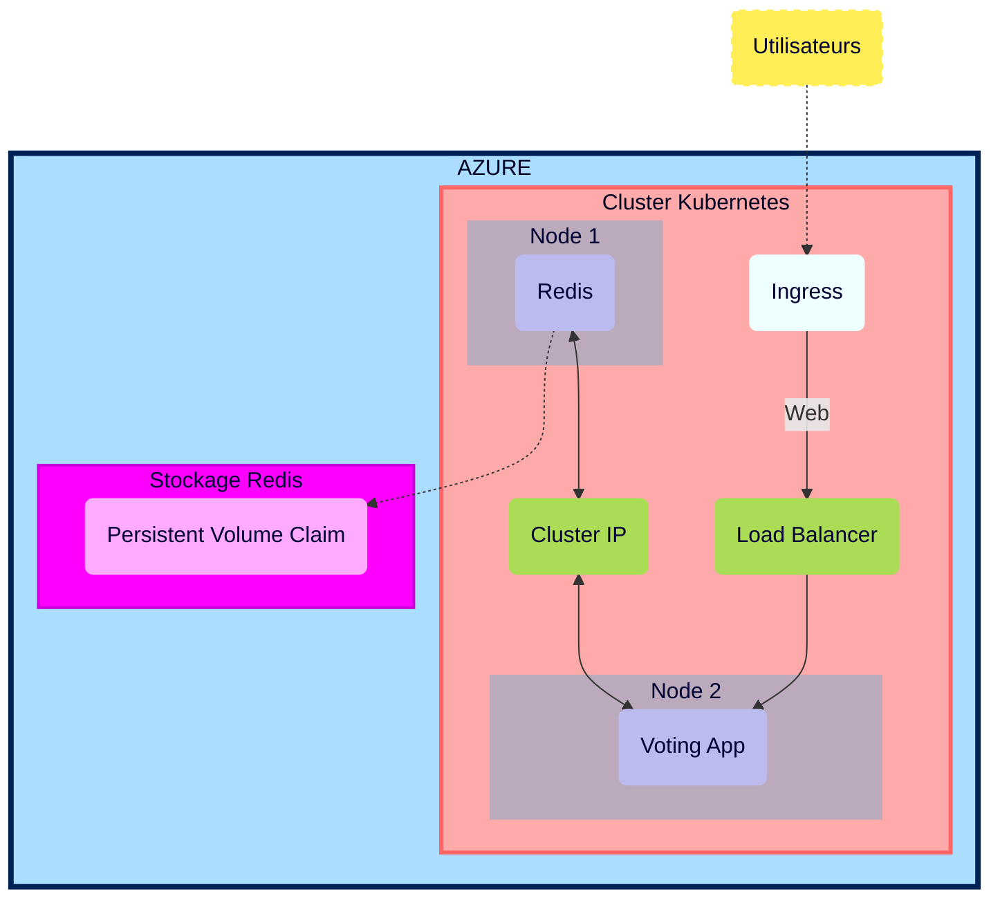

# Plan d'action présentation  

## Plan d'action Brief 6 - Part 1  

  

## Sommaire
#### [0 - Scrum quotidien](#Scrum)
#### [1 - Lecture des documentations Kubernetes et AKS](#Documentations)
#### [2 - Topologie de l'infrastructure](#Topologie)
#### [3 - Liste ressources](#Ressources)
#### [4 - Déploiement d'un cluster AKS avec deux nodes](#ClusterAKS)
#### [5 - Déploiement de Redis](#Redis)
#### [6 - Déploiement de Voting App](#VotingApp)
#### [7 - Déploiement d’un Load Balancer](#LB)
#### [8 - Application d'un ClusterIP pour Redis](#ClusterIP)
#### [9 - Configuration d'un mot de passe pour le container Redis](#MDP)
#### [10 - Création d'un secret Kubenetes](#Secret)
#### [11 - Création d'un compte de stockage](#Stockage)
#### [12 - Configuration d'un Persistent Volume et d'un P.V. Claim](#PVC)
#### [13 - Création d'Ingress controller avec Kubernetes/nginx](#Ingress)
#### [14 - Création d'un enregistrement DNS sur Gandi](#Gandi)
#### [15 - Création d'un certificat TLS avec cert-manager pour la Voting App](#certificat)
#### [16 - Auto-scaling horizontal de la Voting App](#Auto-scaling)
#### [17 - Test de la montée en charge](#Charge)
#### [18 - Executive summary + fonctionnement de Kubernetes](#Summary)
#### [19 - Document d'Architecture Technique de l'infrastructure déployée](#DAT)

## Plan d'action

00. **Scrum quotidien**
Réflexion personnelle quotidiennes avec compte-rendu immédiat et désignation des premières tâches du jour.
Réunions fréquente avec d'autres co-apprenants pour étudier des solutions aux problèmes rencontrés à plusieurs.

[&#8679;](#top)  

  

01.  **Lecture des documentations Kubernetes et AKS**
Lecture des documentations afin de déterminer les fonctionnements, prérequis et outils/logiciels nécessaires pour remplir les différentes tâches du Brief 6.

[&#8679;](#top)  

  

02.  **Topologie de l'infrastructure**
Infrastructure Plannifiée

*Schéma réalisé dans le cas plus général où les pods ne sont pas dans le même node.*
*Les pods sont schématisés par un seul objet même s'ils peuvent représenter plusieurs réplicas.*

[&#8679;](#top)  

  

03.  **Liste ressources**

-----------
| Ressources | Cluster AKS | Redis |  Voting App |
| :--------: | :--------: | :--------: | :--------: |
| Azure service | ✓ | ✓ | ✓ |
| ressource groupe | ✓ |✓ | ✓ |
| SSH (port) | ✗ | 6379 | 80 |
| CPU | ✗ | 100m-250m | 100m-250m |
| Mémoire | ✗ | 128mi-256mi | 128mi-256mi |
| Image | ✗ | redis:latest  | whujin11e/public:azure_voting_app |
| Load Balancer | ✗ | ✓ puis ✗ | ✓ |
| ClusterIP | ✗ | ✗ puis ✓ | ✗ |
| Kebernetes secret | ✓ | ✓ | ✓ |
| Storage secret | ✓ | ✓ | ✓ |
| Storage account (Standard LRS) | ✗ | ✓ | ✓ |
| Persistent Volume | ✗ | ✓ | ✗ |
| Persistent Vol. Claim (3Gi)| ✗ | ✓ | ✗ |
| Ingress | ✓ | ✗ | ✓ |
| Nginx| ✓ | ✗ | ✗ |
| Certificat TLS | ✗ | ✗ | ✓ |
| Auto-scaling | ✗ | ✗ | ✓ |

[&#8679;](#top)  

   

04.    **Déploiement d'un cluster AKS avec deux nodes**

[&#8679;](#top)  

  

05.    **Déploiement de Redis**

[&#8679;](#top)  

  

06.    **Déploiement de Voting App**

[&#8679;](#top)  

  

07.    **Déploiement d’un Load Balancer**

[&#8679;](#top)  

  
   
08.    **Application d'un ClusterIP pour Redis**

[&#8679;](#top)  

  

09.    **Configuration d'un mot de passe pour le container Redis**

[&#8679;](#top)  

  

10.    **Création d'un secret Kubenetes**

[&#8679;](#top)  

  

11.    **Création d'un compte de stockage**

[&#8679;](#top)  

  

12.    **Configuration d'un Persistent Volume et d'un P.V. Claim**

[&#8679;](#top)  

 

13.    **Création d'Ingress controller avec Kubernetes/nginx**
    
[&#8679;](#top)

 

14.    **Création d'un enregistrement DNS sur Gandi**

[&#8679;](#top)

 

15.    **Création d'un certificat TLS avec cert-manager pour la Voting App**

[&#8679;](#top)

 

16.    **Auto-scaling horizontal de la Voting App**

[&#8679;](#top)

 

17.    **Test de la montée en charge**

[&#8679;](#top)

  

18.    **Executive summary + fonctionnement de Kubernetes**

[&#8679;](#top)

 

19. **Document d'Architecture Technique de l'infrastructure déployée**

[&#8679;](#top)
## Partie 1

SubcriptionID: a1f74e2d-ec58-4f9a-a112-088e3469febb
# **Commandes utilisées**

### list services
kubectl get service 

### list pods
kubectl get pods

### describe running and failed pod
kubectl describe pods [name]

### Create AKS Cluster

az aks create -g b6luna -n AKSClusterLuna --enable-managed-identity --node-count 2 --enable-addons monitoring --enable-msi-auth-for-monitoring  --generate-ssh-keys

### Connect to the cluster

az aks get-credentials --resource-group b6luna --name AKSClusterLuna

### Deploy the application
[link](https://learn.microsoft.com/en-us/azure/aks/learn/quick-kubernetes-deploy-cli#code-try-7)

voting.yml

kubectl apply -f voting.yml

### Determine the networking service type

kubectl get service votingapp-azure --watch

### Create KT auth & pwd secret
kubectl create secret generic reddb-pass --from-file=./username.txt --from-file=./password.txt

kubectl create secret generic reddb-pass --from-literal=username=devuser --from-literal=password=password_redis_154

## Volumes

links :

[Multiple Nodes](https://stackoverflow.com/questions/54845025/does-kubernetes-support-persistent-volumes-shared-between-multiple-nodes-in-a-cl)
[AKS Multiple Nodes](https://learn.microsoft.com/fr-fr/azure/aks/azure-files-volume)
[AKS Storage](https://learn.microsoft.com/en-us/azure/aks/concepts-storage)
[AKS Storage Driver](https://learn.microsoft.com/en-us/azure/aks/csi-storage-drivers)
[AKS Azure file claim](https://learn.microsoft.com/en-us/azure/aks/azure-files-volume#mount-file-share-as-an-persistent-volume)
[Create PV](https://learn.microsoft.com/en-us/azure/aks/azure-files-volume)

#### Create KT secret for access to file share
kubectl create secret generic azure-secret --from-literal=azurestorageaccountname=b6lstorageacc --from-literal=azurestorageaccountkey=JBsbcnoq7ufOg+DJ45B6KN4YNow8GkHhjQHaJfyzn5DyVW9eU0mDfWTpUqMCEKDPWc0HZRyesp5s+AStmP212A==

## Partie 2

#### Creation Kluster avec ACR
##### set this to the name of your Azure Container Registry.  It must be globally unique
MYACR=lunacr

##### Run the following line to create an Azure Container Registry if you do not already have one
az acr create -n $MYACR -g b6luna --sku basic

##### Create an AKS cluster with ACR integration
az aks create -g b6luna -n KlusterLuna --enable-managed-identity --node-count 4 --enable-addons monitoring --enable-msi-auth-for-monitoring  --generate-ssh-keys --attach-acr $MYACR

### Connect to the cluster
az aks get-credentials --resource-group b6luna --name KlusterLuna

### Add Gandi webhook jetstack with helm

[jetstack](https://github.com/bwolf/cert-manager-webhook-gandi)

helm repo add jetstack https://charts.jetstack.io

helm install cert-manager jetstack/cert-manager --namespace cert-manager --create-namespace --set installCRDs=true --version v1.9.1 --set 'extraArgs={--dns01-recursive-nameservers=8.8.8.8:53\,1.1.1.1:53}'

#### Gandi secret
kubectl create secret generic gandi-credentials --namespace cert-manager --from-literal=api-token='2DqJpnKJljl9yWQIolq2xRXO'

#### install cert-manager webhook for gandi
helm install cert-manager-webhook-gandi --repo https://bwolf.github.io/cert-manager-webhook-gandi --version v0.2.0 --namespace cert-manager --set features.apiPriorityAndFairness=true  --set logLevel=6 --generate-name

#### create secret role and bind for webhook
kubectl create role access-secret --verb=get,list,watch,update,create --resource=secrets

kubectl create rolebinding --role=access-secret default-to-secrets --serviceaccount=cert-manager:cert-manager-webhook-gandi-1665664967

Apply ingress -> issuer -> certificate

#### update AKS with autoscale

az aks update --resource-group b6luna --name KlusterLuna --enable-cluster-autoscaler --min-count 1 --max-count 8

#### Autoscaling

[Autoscaling](https://kubernetes.io/docs/tasks/run-application/horizontal-pod-autoscale/)
[Autoscaling Walkthrough](https://kubernetes.io/docs/tasks/run-application/horizontal-pod-autoscale-walkthrough/)

