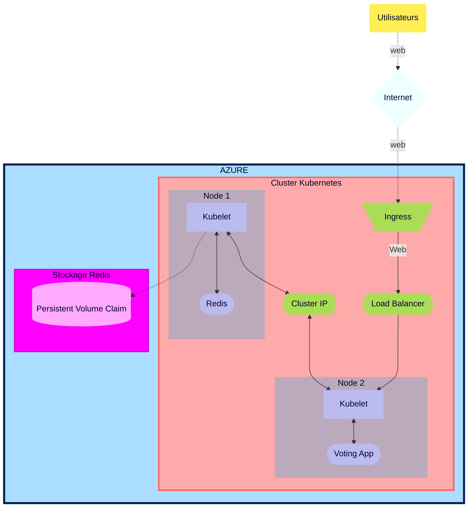

# Action Plan - *Brief 6*

<div id='home'/>  

## Summary
#### [00 - Daily Scrum](#Scrum)
#### [01 - K8s & AKS (powershell, Azure Cli & Bash) doc reading](#Doc)
#### [02 - Architecture Topology](#Topology)
#### [03 - Resource List](#Resources)
#### [04 - AKS cluster deployment with 2 nodes](#ClusterAKS)
#### [05 - Redis Deployment](#Redis)
#### [06 - Load Balancer Deployment](#LB)
#### [07 - ClusterIP application for Redis](#ClusterIP)
#### [08 - Redis password setting](#MDP)
#### [09 - Creation of Kubenetes secret](#Secret)
#### [10 - Creation of Azure Storage Account](#Stockage)
#### [11 - Setting of Persistent Volume & P.V.Claim](#PVC)
#### [12 - Creation of Ingress Controller with Kubernetes Nginx](#Ingress)
#### [13 - Creation of DNS registering on Gandi](#Gandi)
#### [14 - Creation of TLS certificate with Cert-Manager for Voting App](#certificat)
#### [15 - Horizontal Auto-scaling of Voting App](#Auto-scaling)
#### [16 - Load testing](#Charge)
#### [17 - Executive summary + Kubernetes functionnality](#Summary)
#### [18 - Techincal Architecture Document of deployed infrastructure](#TAD)


<div id='Scrum'/>

# Plan d'action

### **Daily Scrum**
Réflexion personnelle quotidiennes avec compte-rendu immédiat et désignation des premières tâches du jour.
Réunions fréquente avec d'autres co-apprenants pour étudier des solutions aux problèmes rencontrés à plusieurs.

[scrums](https://github.com/Simplon-Luna/b6_Luna/blob/main/Scrum.md)

[&#8679;](#home)

<div id='Doc'/>

### **K8s & AKS (powershell, Azure Cli & Bash) doc reading**
Reading of documentations to determine the functionnalitiez, prerequisites and different tools required to accomplish Brief 6.

[&#8679;](#home)

<div id='Topologie'/>

### **Infrastructure Topology**
Planified Architecture

*Schematic is made for the most generalize case where the pods aren't in the same node.*
*Pods are schematized by a single item even if they can represent multiple replicas.*



[&#8679;](#home)

<div id='Resources'/>

### **Resources List**

-----------
| Ressources | Cluster AKS | Redis |  Voting App |
| :--------: | :--------: | :--------: | :--------: |
| Azure service | ✓ | ✓ | ✓ |
| resource groupe | ✓ |✓ | ✓ |
| SSH (port) | N/A | 6379 | 80 |
| CPU limit | N/A | 100m-250m | 100m-250m |
| Mémoire limit | N/A | 128mi-256mi | 128mi-256mi |
| Image | N/A | redis:latest  | whujin11e/public:azure_voting_app |
| Load Balancer | N/A | ✓ puis ✗ | ✓ |
| ClusterIP | N/A | ✗ puis ✓ | ✗ |
| Kebernetes secret | ✓ | ✓ | ✓ |
| Storage secret | ✓ | ✓ | ✓ |
| Storage account (Standard LRS) | N/A | ✓ | ✓ |
| Persistent Volume | N/A | ✓ | ✗ |
| Persistent Vol. Claim (3Gi)| N/A | ✓ | ✗ |
| Ingress | ✓ | ✗ | ✓ |
| Nginx| ✓ | ✗ | ✗ |
| Certificat TLS | N/A | ✗ | ✓ |
| Auto-scaling | ✗ | ✗ | ✓ (deployment) |

SubcriptionID: a1f74e2d-ec58-4f9a-a112-088e3469febb

[&#8679;](#home)

<div id='ClusterAKS'/>

### **AKS cluster deployment with 2 nodes**

[***Tutorial***](https://learn.microsoft.com/en-us/azure/aks/tutorial-kubernetes-deploy-cluster?tabs=azure-cli)

```bash
az aks create -g b6luna -n AKSClusterLuna --enable-managed-identity --node-count 2 --enable-addons monitoring --enable-msi-auth-for-monitoring  --generate-ssh-keys
```

##### Connect to the cluster

```bash
az aks get-credentials --resource-group b6luna --name AKSClusterLuna
```

[&#8679;](#home)

<div id='Redis'/>

### **Redis & Voting App Deployment**

[***Tutorial***](https://learn.microsoft.com/en-us/azure/aks/learn/quick-kubernetes-deploy-cli#code-try-7)

voting.yml

kubectl apply -f voting.yml

[&#8679;](#home)

<div id='LB'/>

### **Load Balancer Deployment**

[&#8679;](#home)

<div id='ClusterIP'/>
   
### **ClusterIP application for Redis**

[&#8679;](#home)

<div id='MDP'/>

### **Redis password setting**

[&#8679;](#home)

<div id='Secret'/>

### **Creation of Kubenetes secret**

[&#8679;](#home)

<div id='Stockage'/>

### **Creation of Azure Storage Account**

[&#8679;](#home)

<div id='PVC'/>

### **Setting of Persistent Volume & P.V.Claim**

[&#8679;](#home)

<div id='Ingress'/>

### **Creation of Ingress Controller with Kubernetes Nginx**
    
[&#8679;](#home)

<div id='Gandi'/>

### **Creation of DNS registering on Gandi**

[&#8679;](#home)

<div id='Certificat'/>

### **Creation of TLS certificate with Cert-Manager for Voting App**

[&#8679;](#home)

<div id='Auto-scaling'/>

### **Horizontal Auto-scaling of Voting App**

[&#8679;](#home)

<div id='Charge'/>

### **Load testing**

[&#8679;](#home)

<div id='Summary'/>

### **Executive summary + Kubernetes functionnality**

[&#8679;](#home)

<div id='TAD'/>

### **Techincal Architecture Document of deployed infrastructure**

[&#8679;](#home)
## Partie 1

# **Commandes utilisées**


### list services
kubectl get service 

### list pods
kubectl get pods

### describe running and failed pod
kubectl describe pods [name]


### Create AKS Cluster

az aks create -g b6luna -n AKSClusterLuna --enable-managed-identity --node-count 2 --enable-addons monitoring --enable-msi-auth-for-monitoring  --generate-ssh-keys

### Connect to the cluster

az aks get-credentials --resource-group b6luna --name AKSClusterLuna

### Deploy the application
[link](https://learn.microsoft.com/en-us/azure/aks/learn/quick-kubernetes-deploy-cli#code-try-7)

voting.yml

kubectl apply -f voting.yml

### Determine the networking service type

kubectl get service votingapp-azure --watch

### Create KT auth & pwd secret
kubectl create secret generic reddb-pass --from-file=./username.txt --from-file=./password.txt

kubectl create secret generic reddb-pass --from-literal=username=devuser --from-literal=password=password_redis_154

## Volumes

links :

[Multiple Nodes](https://stackoverflow.com/questions/54845025/does-kubernetes-support-persistent-volumes-shared-between-multiple-nodes-in-a-cl)
[AKS Multiple Nodes](https://learn.microsoft.com/fr-fr/azure/aks/azure-files-volume)
[AKS Storage](https://learn.microsoft.com/en-us/azure/aks/concepts-storage)
[AKS Storage Driver](https://learn.microsoft.com/en-us/azure/aks/csi-storage-drivers)
[AKS Azure file claim](https://learn.microsoft.com/en-us/azure/aks/azure-files-volume#mount-file-share-as-an-persistent-volume)
[Create PV](https://learn.microsoft.com/en-us/azure/aks/azure-files-volume)

#### Create KT secret for access to file share
kubectl create secret generic azure-secret --from-literal=azurestorageaccountname=b6lstorageacc --from-literal=azurestorageaccountkey=JBsbcnoq7ufOg+DJ45B6KN4YNow8GkHhjQHaJfyzn5DyVW9eU0mDfWTpUqMCEKDPWc0HZRyesp5s+AStmP212A==

## Partie 2

#### Creation Kluster avec ACR
##### set this to the name of your Azure Container Registry.  It must be globally unique
MYACR=lunacr

##### Run the following line to create an Azure Container Registry if you do not already have one
az acr create -n $MYACR -g b6luna --sku basic

##### Create an AKS cluster with ACR integration
az aks create -g b6luna -n KlusterLuna --enable-managed-identity --node-count 4 --enable-addons monitoring --enable-msi-auth-for-monitoring  --generate-ssh-keys --attach-acr $MYACR

### Connect to the cluster
az aks get-credentials --resource-group b6luna --name KlusterLuna

### Add Gandi webhook jetstack with helm

[jetstack](https://github.com/bwolf/cert-manager-webhook-gandi)

helm repo add jetstack https://charts.jetstack.io

helm install cert-manager jetstack/cert-manager --namespace cert-manager --create-namespace --set installCRDs=true --version v1.9.1 --set 'extraArgs={--dns01-recursive-nameservers=8.8.8.8:53\,1.1.1.1:53}'

#### Gandi secret
kubectl create secret generic gandi-credentials --namespace cert-manager --from-literal=api-token='2DqJpnKJljl9yWQIolq2xRXO'

#### install cert-manager webhook for gandi
helm install cert-manager-webhook-gandi --repo https://bwolf.github.io/cert-manager-webhook-gandi --version v0.2.0 --namespace cert-manager --set features.apiPriorityAndFairness=true  --set logLevel=6 --generate-name

#### create secret role and bind for webhook
kubectl create role access-secret --verb=get,list,watch,update,create --resource=secrets

kubectl create rolebinding --role=access-secret default-to-secrets --serviceaccount=cert-manager:cert-manager-webhook-gandi-1665664967

Apply ingress -> issuer -> certificate

#### update AKS with autoscale

az aks update --resource-group b6luna --name KlusterLuna --enable-cluster-autoscaler --min-count 1 --max-count 8

#### Autoscaling

[Autoscaling](https://kubernetes.io/docs/tasks/run-application/horizontal-pod-autoscale/)
[Autoscaling Walkthrough](https://kubernetes.io/docs/tasks/run-application/horizontal-pod-autoscale-walkthrough/)

