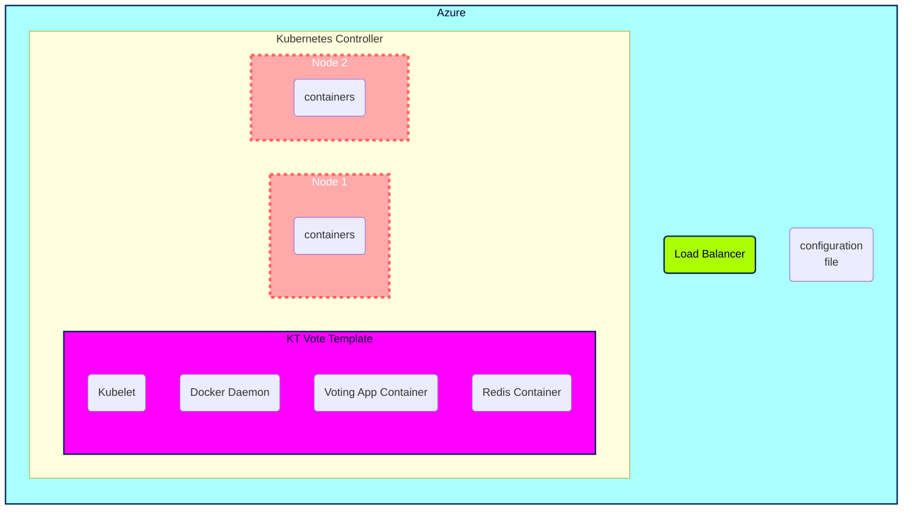

# Plan d'action présentation  

## Plan d'action

00. **Scrum quotidien**
Réflexion personnelle quotidiennes avec compte-rendu immédiat et désignation des premières tâches du jour.
Réunions fréquente avec d'autres co-apprenants pour étudier des solutions aux problèmes rencontrés à plusieurs.

1.  **Création Kanban**

2.  **Lecture des documentations Kubernetes en Azure CLI & Powershell**

3.  **Topologie de l'infrastructure**
Infrastructure Plannifiée

## Partie 1

SubcriptionID: a1f74e2d-ec58-4f9a-a112-088e3469febb
# **Commandes utilisées**

### list services
kubectl get service 

### list pods
kubectl get pods

### describe running and failed pod
kubectl describe pods [name]

### Create AKS Cluster

az aks create -g b6luna -n AKSClusterLuna --enable-managed-identity --node-count 2 --enable-addons monitoring --enable-msi-auth-for-monitoring  --generate-ssh-keys

### Connect to the cluster

az aks get-credentials --resource-group b6luna --name AKSClusterLuna

### Deploy the application
[link](https://learn.microsoft.com/en-us/azure/aks/learn/quick-kubernetes-deploy-cli#code-try-7)

voting.yml

kubectl apply -f voting.yml

### Determine the networking service type

kubectl get service votingapp-azure --watch

### Create KT auth & pwd secret
kubectl create secret generic reddb-pass --from-file=./username.txt --from-file=./password.txt

kubectl create secret generic reddb-pass --from-literal=username=devuser --from-literal=password=password_redis_154

## Volumes

links :

[Multiple Nodes](https://stackoverflow.com/questions/54845025/does-kubernetes-support-persistent-volumes-shared-between-multiple-nodes-in-a-cl)
[AKS Multiple Nodes](https://learn.microsoft.com/fr-fr/azure/aks/azure-files-volume)
[AKS Storage](https://learn.microsoft.com/en-us/azure/aks/concepts-storage)
[AKS Storage Driver](https://learn.microsoft.com/en-us/azure/aks/csi-storage-drivers)
[AKS Azure file claim](https://learn.microsoft.com/en-us/azure/aks/azure-files-volume#mount-file-share-as-an-persistent-volume)
[Create PV](https://learn.microsoft.com/en-us/azure/aks/azure-files-volume)

#### Create KT secret for access to file share
kubectl create secret generic azure-secret --from-literal=azurestorageaccountname=b6lstorageacc --from-literal=azurestorageaccountkey=JBsbcnoq7ufOg+DJ45B6KN4YNow8GkHhjQHaJfyzn5DyVW9eU0mDfWTpUqMCEKDPWc0HZRyesp5s+AStmP212A==

## Partie 2

#### Creation Kluster avec ACR
##### set this to the name of your Azure Container Registry.  It must be globally unique
MYACR=lunacr

##### Run the following line to create an Azure Container Registry if you do not already have one
az acr create -n $MYACR -g b6luna --sku basic

##### Create an AKS cluster with ACR integration
az aks create -g b6luna -n KlusterLuna --enable-managed-identity --node-count 4 --enable-addons monitoring --enable-msi-auth-for-monitoring  --generate-ssh-keys --attach-acr $MYACR

### Connect to the cluster
az aks get-credentials --resource-group b6luna --name KlusterLuna

### Add Gandi webhook jetstack with helm

[jetstack](https://github.com/bwolf/cert-manager-webhook-gandi)

helm repo add jetstack https://charts.jetstack.io

helm install cert-manager jetstack/cert-manager --namespace cert-manager --create-namespace --set installCRDs=true --version v1.9.1 --set 'extraArgs={--dns01-recursive-nameservers=8.8.8.8:53\,1.1.1.1:53}'

#### Gandi secret
kubectl create secret generic gandi-credentials --namespace cert-manager --from-literal=api-token='2DqJpnKJljl9yWQIolq2xRXO'

#### install cert-manager webhook for gandi
helm install cert-manager-webhook-gandi --repo https://bwolf.github.io/cert-manager-webhook-gandi --version v0.2.0 --namespace cert-manager --set features.apiPriorityAndFairness=true  --set logLevel=6 --generate-name

#### create secret role and bind for webhook
kubectl create role access-secret --verb=get,list,watch,update,create --resource=secrets

kubectl create rolebinding --role=access-secret default-to-secrets --serviceaccount=cert-manager:cert-manager-webhook-gandi-1665664967

Apply ingress -> issuer -> certificate

#### update AKS with autoscale

az aks update --resource-group b6luna --name KlusterLuna --enable-cluster-autoscaler --min-count 1 --max-count 8

#### 